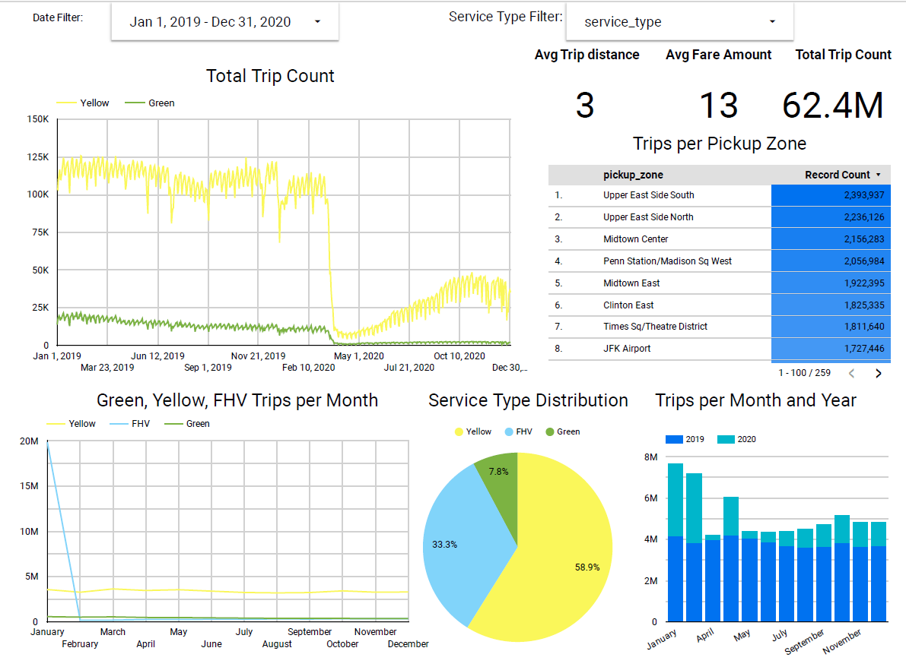

# NYC Taxi Trips Data Project (BigQuery, DBT Cloud and Looker Studio)

This project, developed as part of the Data Engineering Zoomcamp, focuses on ingesting, transforming, and visualizing New York City (NYC) taxi trip data using Google BigQuery, DBT Cloud, and Looker Studio.

## Objective
The primary goal is to process NYC taxi trip data spanning 2019 and 2020, covering Yellow and Green taxi data, as well as For-Hire Vehicle (FHV) data for 2019. The process involves ingesting raw data from CSV files hosted on a public GitHub repository, transforming it using DBT Cloud, and visualizing insights using Looker Studio.

## Components
### 1. Data Ingestion
Google Cloud Platform's Storage and BigQuery APIs are used to ingest CSV files containing NYC taxi trip data. The data includes Yellow and Green taxi records for 2019 and 2020, as well as FHV data for 2019.

### 2. Data Transformation
DBT Cloud is employed for data transformation tasks. This involves creating tables such as `fact_trips` and `fact_fhv` from the ingested data in the BigQuery dataset. Additionally, various other transformations and tables are created as required for downstream analysis.

### 3. Visualization
Looker Studio is utilized for visualizing the transformed data. The dashboard created using Looker provides intuitive visualizations and insights into the NYC taxi trip data, enabling easier interpretation and analysis.

## Project Structure
- `./scripts`: Contains Python and shell scripts for data ingestion.
- `./dbt`: Holds DBT configurations and SQL transformations.
- `./img`: Contains images, including the DBT lineage graph and Looker dashboard.
- `README.md`: Documentation providing an overview of the project, setup instructions, and usage guidelines.

## How to Use
1. Ingest the NYC taxi trip data into Google BigQuery.
2. Configure DBT Cloud and execute the transformations.
3. Utilize Looker Studio to visualize insights from the transformed data.

## Looker Studio Dashboard

## DBT Lineage Graph

## Conclusion
This project demonstrates the end-to-end process of ingesting, transforming, and visualizing NYC taxi trip data using Google BigQuery, DBT Cloud, and Looker Studio. By leveraging these tools, meaningful insights can be derived from raw data, facilitating informed decision-making and analysis in the domain of data engineering and analytics.

**Note:** This project is part of the Data Engineering Zoomcamp.
